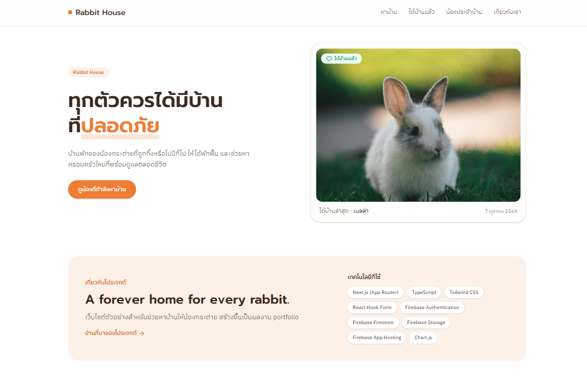
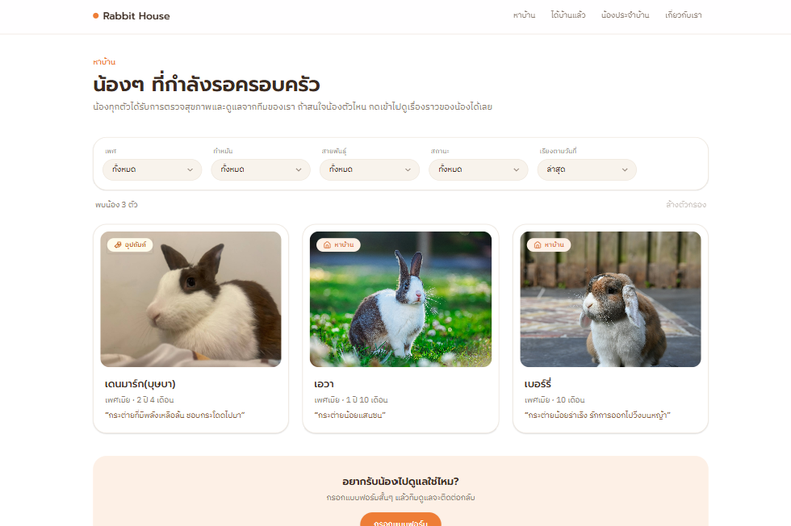
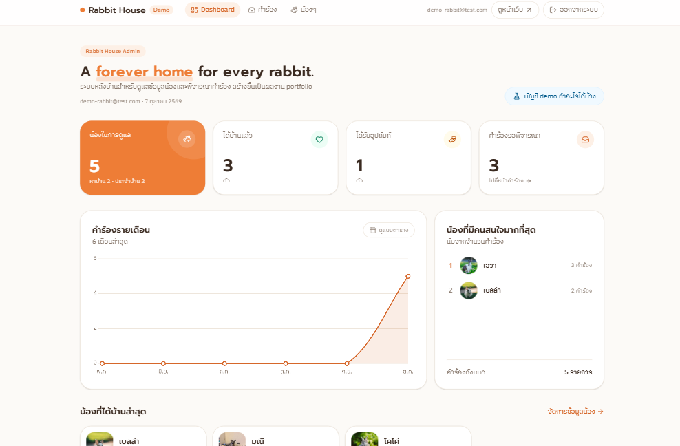
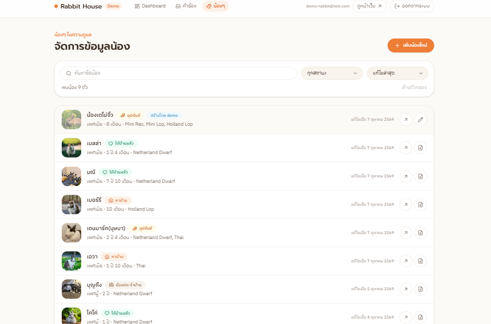

# Rabbit House 🐰

**A forever home for every rabbit.**

Rabbit House is a rabbit rescue and adoption website. It gathers rabbits that are looking for a home, rabbits that have already been adopted, and the residents who live with us permanently, so people can get to know each rabbit and apply to adopt or sponsor one. Behind it is an admin system for reviewing applications and managing rabbit data.

The idea started as a high school project to help an animal shelter in Chiang Mai. Years later, as a programmer with four rabbits of my own and inspired by a rabbit café that rescues and rehomes rabbits, I finally built it.

🔗 **Live demo:** [rabbit-house--safe-rabbit-project.asia-southeast1.hosted.app](https://rabbit-house--safe-rabbit-project.asia-southeast1.hosted.app)

🔐 **Admin demo:** open `/admin/login` and switch on **"ใช้บัญชี demo"** to sign in with the demo account. Everything you try runs in a sandbox and never changes the real data.

## Screenshots

| Home | Rabbit profile |
| --- | --- |
|  |  |

| Admin dashboard | Application review |
| --- | --- |
|  |  |

## Features

### Public website

- **Rabbit listings** for rabbits looking for a home, adopted rabbits, and permanent residents
- **Filters and sorting** by gender, neutered status, breed (multi-select), status, and date, using one reusable component across pages
- **Rabbit profile pages** with a photo gallery, instant image switching, and a fullscreen viewer (keyboard and arrow navigation)
- **Adoption / sponsorship form** with validation by React Hook Form, saved to Firestore and checked by Security Rules
- **Live data from Firebase**: pages revalidate every 60 seconds
- **Responsive design** for mobile, tablet, and desktop

### Admin system

- **Login and roles** with Firebase Authentication: an `owner` role with full access and a `demo` role with limited access, plus automatic logout after 24 hours
- **Dashboard** with KPI cards, a monthly applications chart (Chart.js), the most requested rabbits, and recently adopted rabbits
- **Application review** with tabs, search, rabbit filter, sorting, and pagination. Approving uses `writeBatch` so the application and the rabbit status update together. Approving an adoption auto-rejects the other pending applications for that rabbit. Rejecting requires a reason, which is saved with the application.
- **Rabbit management**: add and edit rabbits, and upload photos to Firebase Storage with file type and size checks
- **Demo sandbox**: rabbits created by the demo account stay hidden from public listings, and the owner can reset all demo data in one click
- **Security Rules** for Firestore and Storage that check roles, allowed fields, and data shape on the server

## Tech Stack

- [Next.js](https://nextjs.org/) (App Router, Server Components)
- TypeScript
- Tailwind CSS
- React Hook Form
- Firebase Authentication, Firestore, and Storage
- Firebase App Hosting
- Chart.js (react-chartjs-2)
- lucide-react (icons)

## Project Structure

```txt
app/(site)/        Public pages (home, rabbits, adopt, about)
app/admin/         Admin pages (login, dashboard, applications, rabbits)
components/        Reusable UI components
components/admin/  Admin components (AuthProvider, RabbitForm, charts, ...)
lib/               Firebase setup, data services, and display helpers
types/             TypeScript types
firestore.rules    Firestore Security Rules
storage.rules      Storage Security Rules
```

## Getting Started

1. Install dependencies:

   ```bash
   npm install
   ```

2. Create a `.env` file with your Firebase config:

   ```txt
   NEXT_PUBLIC_FIREBASE_API_KEY=
   NEXT_PUBLIC_FIREBASE_AUTH_DOMAIN=
   NEXT_PUBLIC_FIREBASE_PROJECT_ID=
   NEXT_PUBLIC_FIREBASE_STORAGE_BUCKET=
   NEXT_PUBLIC_FIREBASE_MESSAGING_SENDER_ID=
   NEXT_PUBLIC_FIREBASE_APP_ID=
   ```

3. In the Firebase Console:
   - Publish `firestore.rules` and `storage.rules`
   - Create a user in Authentication
   - Add a document `admins/{uid}` with `role: "owner"` (or `"demo"`)

4. Run the development server and open http://localhost:3000:

   ```bash
   npm run dev
   ```

## Roadmap

- [x] Rabbit listings, profiles, and filters
- [x] Adoption / sponsorship form saved to Firestore
- [x] Admin login with Firebase Authentication
- [x] Admin dashboard and application review
- [x] Rabbit management with photo upload
- [x] Demo account with sandboxed data

## About

Built as a personal portfolio project by [Sarocha Chang](https://www.linkedin.com/in/sarocha-chang-833172274/).
